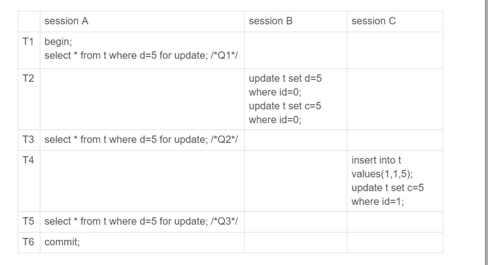

 

> 问题： 假如公司没有大量业务？假如公司不重视mysql ？你就不学习了吗？
>
> 
>
>  回答：记录Mysql 学习过程。日供一卒
>
>  对于公司来说，业务，架构，甚至管理 从来不考虑这个问题，
>
>  作为普通it来说，必须掌握技能，从陌生到熟悉然后到精通。
>
> 你目标也不是DBA,你只需要完成下面四个步骤就可以了。
>
> 
# 更新日志

| 日期      | 更新内容     | 备注     |
| --------- | ------------ | -------- |
| 2020-5-28 | 资料查询 | 持续更新 |

# 第一步 基础知识搜集

### 1.1  [廖雪峰的官方网站](https://www.liaoxuefeng.com/)

https://www.liaoxuefeng.com/wiki/1177760294764384/1179611448454560

https://github.com/michaelliao/learn-sql/blob/master/mysql/init-test-data.sql

- 请使用一条语句 统计各班的男生和女生人数

SELECT class_id, gender, COUNT(*) num FROM students GROUP BY class_id, gender;

- 请使用一条SELECT查询查出每个班级男生和女生的平均分：

```mysql
select class_id, gender,AVG(score)
 from students
 group by class_id,gender
```


- 多个列进行分组 using-group-by-on-multiple-columns
- 慢日志
### 1.2 安装部署基于MySQL5.6.官方文档如下。
  http://dev.mysql.com/doc/refman/5.6/en/mrr-optimization.html
=======
[一次group by 优化之旅](https://juejin.im/post/5ced5191e51d455070226f26)

### 1.2 部署安装

~~~shell
centos6.8
yum -y install mysql mysql-server mysql-devel //从yum库中的安装mysql
rpm -qi mysql-server //验证是否安装成功
 service mysqld start //启动mysql服务
输入命令： 
 mysql -u root
mysql -u root -p

建立远程root用户

GRANT ALL PRIVILEGES ON *.* TO 'root'@'%' IDENTIFIED BY '123456' WITH GRANT OPTION;

flush privileges;

修改密码
更改mysql密码，要FLUSH PRIVILEGES; 才生效
mysql -u root 
mysql> use mysql; 
mysql> update user set password=password('123456') where user='root'; 
mysql> FLUSH PRIVILEGES; 
mysql> quit; 
# service mysqld restart

mysql -u root -p  123456

sudo apt-get install mysql-client mysql-server
sudo service mysql status
sudo service mysqld start

/etc/init.d/networking restart
select user, plugin from mysql.user;	
update mysql.user set authentication_string=PASSWORD('123456'), plugin='mysql_native_password' where user='root';

~~~


~~~shell

 mysql> create database  dream;
Query OK, 1 row affected (0.01 sec)

mysql> use dream;
Database changed

mysql+5.7+设置远程登录
在ubuntu14.04上安装好mysql5.7之后，本地可以连接mysql服务器。
远程就不行。

注释掉在/etc/mysql/mysql.conf.d/mysqld.cnf里面的bind-address = 127.0.0.1

GRANT ALL PRIVILEGES ON *.* TO 'root'@'%' IDENTIFIED BY 'root' WITH GRANT OPTION;

~~~


#### ubuntu mysql 5.7

https://cloud.tencent.com/developer/article/1392435

~~~shell
sudo apt-get autoremove --purge mysql-server-5.0
sudo apt-get remove mysql-server
sudo apt-get autoremove mysql-server
sudo apt-get remove mysql-common //这个很重要
上面的其实有一些是多余的
dpkg -l |grep ^rc|awk '{print $2}' |sudo xargs dpkg -P
sudo apt-get install mysql-server
sudo apt-get install mysql-client
sudo apt-get install php5-mysql 
// 安装php5-mysql 是将php和mysql连接起来
一旦安装完成，MySQL 服务器应该自动启动。您可以在终端提示符后运行以下命令来检查 MySQL 服务器是否正在运行：
sudo netstat -tap | grep mysql

 mysql -V
mysql  Ver 14.14 Distrib 5.7.29, for Linux (x86_64) using  EditLine wrapper
root@work:~# 


mysqladmin -uroot -p password 123456 


#查看mysql状态
/etc/init.d/mysql status 或者 service mysql status
#启动mysql
/etc/init.d/mysql start 或者 service mysql start
#停止mysql
/etc/init.d/mysql stop 或者 service mysql stop
#重新启动mysql
/etc/init.d/mysql restart 或者 service mysql restart
查看mysql服务说明启动成功

————————————————
版权声明：本文为CSDN博主「南有乔木灬」的原创文章，遵循 CC 4.0 BY-SA 版权协议，转载请附上原文出处链接及本声明。
原文链接：https://blog.csdn.net/wudawei071193/java/article/details/100777206

 /etc/init.d/networking restart
~~~

- 多个列进行分组 using-group-by-on-multiple-columns
- 慢日志

  

# 第二步 阅读相关数据

## 高性能Mysql第三版

## MySQL技术内幕(InnoDB存储引擎)


# 第三步 MySQL实战45讲
### 输出文档5篇 [必须动手操作,测试数据随便造]
搜集整理相关文章：
- [深入理解 MySQL——MySQL 选错索引怎么办](https://blog.leosocy.top/%E6%B7%B1%E5%85%A5%E%90%86%E8%A7%A3MySQL%E2%80%94%E2%80%94MySQL%E9%80%89%E9%94%99%E7%B4%A2%E5%BC%95%E6%80%8E%E4%B9%88%E5%8A%9E/)

- [一次 group by + order by 性能优化分析](https://mengkang.net/s/1355.html)

- [数据库内核月报](http://mysql.taobao.org/monthly/2016/01/01/)

- [一个案例彻底弄懂如何正确使用 mysql inndb 联合索引](https://mengkang.net/1302.html)

- https://testerhome.com/topics/16505


### 流程图
这里后面补充整个xmind脑图【遗漏任务】


### 第一天：幻读是什么，幻读有什么问题？  


~~~MySQL
mysql -u root -p  123456

drop table t;
CREATE TABLE `t` (
`id` int(11) NOT NULL,
`c` int(11) DEFAULT NULL,
`d` int(11) DEFAULT NULL,
PRIMARY KEY (`id`),
KEY `c` (`c`)
) ENGINE=InnoDB;

insert into t values(0,0,0),(5,5,5),
(10,10,10),(15,15,15),(20,20,20),(25,25,25);

session a：

mysql> begin;
Query OK, 0 rows affected (0.00 sec)

mysql> select * from t where d=5 ;
+----+------+------+
| id | c    | d    |
+----+------+------+
|  5 |    5 |    5 |
+----+------+------+
1 row in set (0.00 sec)

mysql> commit;
Query OK, 0 rows affected (0.00 sec)

mysql> select * from t where d=5 ;
+----+------+------+
| id | c    | d    |
+----+------+------+
|  0 |    0 |    5 |
|  1 |    5 |    5 |
|  5 |    5 |    5 |
+----+------+------+
3 rows in set (0.00 sec)


session b：
mysql>  update t set d=5 where id=0;
Query OK, 1 row affected (0.00 sec)
Rows matched: 1  Changed: 1  Warnings: 0

select * from t where d=5 ;
+----+------+------+
| id | c    | d    |
+----+------+------+
|  0 |    0 |    5 |
|  5 |    5 |    5 |
+----+------+------+

select * from t where d=5 for update;
mysql> update t set d=5 where id=0;
ERROR 1205 (HY000): Lock wait timeout exceeded; try restarting transaction

session c

insert into t values(1,1,5);
update t SET C=5 WHERE ID=1;

mysql 查询有分段加锁的设计。
select * from t where id <10 for update ，
select * from t where id =16 for update 不存在）

ConcurrentHashMap 同样有分段锁策略
在 JDK1.7 中，ConcurrentHashMap 
将一个 HashMap 切割成 Segment 数组，其中 Segment 可以看成一个 HashMap

~~~





